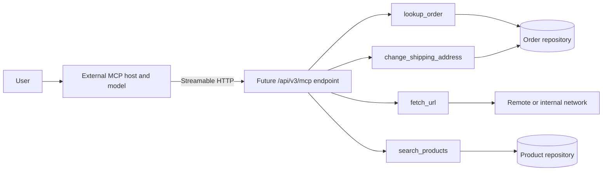

# Implementation Plan: MCP Agent Security Feasibility

**Branch**: `016-mcp-agent-tools` | **Date**: 2026-09-16 | **Spec**: [spec.md](./spec.md)

**Input**: Feature specification from `specs/016-mcp-agent-tools/spec.md`

## Summary

Document the feasibility and security-testing value of exposing the existing pharmacy agent capabilities
through a future remote MCP server. The current deliverable is limited to this spec set and its linked
GitHub issue; the recommended implementation architecture and all executable work remain deferred.

## Technical Context

- **Affected packages**: none in the current documentation scope; future work is expected in `@iwa/agent`,
  `@iwa/api`, and conditionally `@iwa/web`
- **Dependencies added/changed**: none
- **Data model changes**: none
- **Runtime/configuration changes**: none
- **Unknowns**: whether current Fortify SAST or FAA versions model the selected MCP SDK and remote tool
  boundary; this must be established through future baseline-comparison scans

## Feasibility Assessment

The proposal is technically feasible and moderately practical. The existing Node.js 20, TypeScript, ESM,
Express, Zod, and npm-workspace environment can host a current MCP TypeScript SDK implementation. The API
package already owns the order and product repositories, the HTTP process, Docker packaging, and Vitest
harness needed by the proposed tools.

The security-testing benefit is less certain than the implementation feasibility. The bundled JavaScript
rulepacks contain no observed explicit MCP SDK signatures, while current FAA output demonstrates semantic
reasoning about prompt injection, excessive agency, and model-to-tool boundaries. A future MCP experiment is
therefore more likely to enrich FAA architecture coverage than to create new traditional SAST categories.

## Recommended Future Architecture



- Mount a stateless Streamable HTTP endpoint at `/api/v3/mcp` in `@iwa/api`.
- Use the current stable MCP TypeScript SDK and its documented Node/Express transport adapter.
- Expose four capabilities as separate tools: `lookup_order`, `change_shipping_address`, `fetch_url`, and
  `search_products`.
- Keep repository and network operations directly visible in tool handlers so future scanners can observe
  ordinary source-to-sink flows.
- Preserve the existing `ChatOpenAI.invoke()` call shape in `packages/agent/src/AgentService.ts`; do not
  refactor established intentional vulnerabilities merely to share MCP code.
- Treat server-side authorization and confirmation as application responsibilities even when the external
  MCP host offers a user-approval interface.

## Analyzer Evidence Strategy

1. Record the existing `iwa-nodejs-20260915173034.fpr` and `iwa-nodejs.faa.sarif` findings as the baseline.
2. After a separately approved implementation, run `bin/sast-scan.ps1` and `bin/faa-scan.ps1` to produce
   fresh artifacts.
3. Compare analyzer, category, source, sink, file path, and dataflow against the baseline.
4. Label a catalog row `SAST` only when the new FPR contains a corresponding trace involving the MCP
   implementation.
5. Label a catalog row `FAA` only when the new SARIF identifies the MCP endpoint, tool authority boundary,
   or external-agent chain rather than only repeating the existing agent finding.
6. Document negative results. Lack of analyzer recognition is useful evidence and must not be hidden by
   adding unrelated vulnerable sinks.

## Alternatives Considered

| Alternative                                    | Decision                      | Reason                                                                                                                  |
| ---------------------------------------------- | ----------------------------- | ----------------------------------------------------------------------------------------------------------------------- |
| Local stdio MCP server                         | Defer                         | Simple for desktop clients, but does not exercise remote authentication, Origin validation, or DNS-rebinding boundaries |
| Separate `packages/mcp-server` workspace       | Reject for initial experiment | Duplicates repository adapters and adds workspace, Docker, process, and ScanCentral packaging complexity                |
| Expose `AgentService.chat()` as one MCP tool   | Reject                        | Mostly wraps the existing endpoint and obscures individual tool authority and dataflow                                  |
| Add generic vulnerable sinks for SAST          | Reject                        | Would measure known source-to-sink rules rather than MCP-specific analyzer value                                        |
| Replace the current agent tools with MCP calls | Reject                        | Risks changing existing demonstrations and Fortify-sensitive LangChain traces                                           |

## Constitution Check

_GATE: passed for the documentation-only scope; re-check before any future implementation._

- [x] **I. Intentional Insecurity Is Sacrosanct** — no existing `INSECURE:` marker, vulnerability table
      entry, implementation, or pinned vulnerable dependency is changed.
- [x] **II. Documented Vulnerability Lifecycle** — this documentation adds no vulnerability. The deferred
      backlog requires markers, catalog treatment, regression tests, and `DEMO.md` payloads for every future
      intentional vulnerability.
- [x] **III. Monorepo Workspace Boundaries** — no package or build configuration changes are made. The future
      recommendation stays within the existing `@iwa/api` workspace.
- [x] **IV. Fault-Tolerant Runtime Configuration** — no credential, environment variable, or runtime service
      is introduced.
- [x] **V. Fixable Bugs vs. Preserved Vulnerabilities** — no bug or documented vulnerability is modified.

## Project Structure

### Documentation Added by This Feature

```text
specs/016-mcp-agent-tools/
├── spec.md
├── plan.md
└── tasks.md
```

### Deferred Future Implementation Surface

```text
packages/
├── agent/src/AgentService.ts              # preserve current model invocation and tool semantics
├── api/src/api/v3/mcp.ts                  # proposed Streamable HTTP MCP endpoint
├── api/src/app.ts                         # proposed route mount
├── api/tests/mcp/                         # proposed protocol tests
├── api/tests/vulnerabilities/             # proposed vulnerability regression tests
└── web/src/publicPages.tsx                 # conditional catalog updates after scan evidence
```

## Documentation Validation

- Confirm the folder contains exactly the three required Markdown files.
- Confirm all current-scope requirements and success criteria are documentation-verifiable.
- Confirm future implementation tasks remain unchecked.
- Confirm no executable file, dependency manifest, test, scan artifact, `DEMO.md`, or vulnerability catalog
  file changes in this feature.
- Confirm the linked GitHub feature issue points to this folder and this spec references the assigned issue.

## Complexity Tracking

No constitution violation or additional implementation complexity is introduced by the documentation-only
scope.
